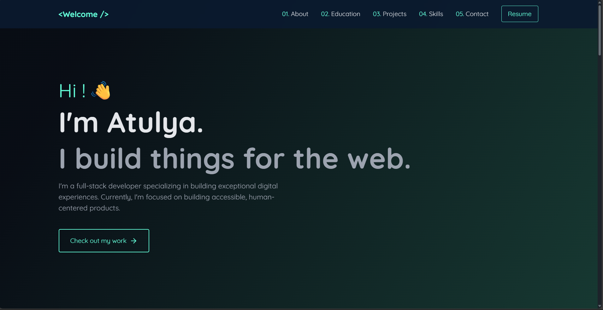

# My Portfolio

Welcome to my personal portfolio repository! This project is a showcase of my development skills, projects, and experience. The codebase is primarily written in **TypeScript**, with additional use of **CSS**, **HTML**, and **JavaScript** for styling, structure, and interactivity.

---

## 🚀 About Me

Hi! I'm a passionate web developer with a focus on creating modern, responsive, and user-friendly web applications. My expertise lies in TypeScript and frontend technologies, and I love bringing ideas to life through code. This portfolio highlights some of my favorite projects and what I can do.

---

## 🛠️ Tech Stack

- **TypeScript** (Main language)
- **CSS** (Styling)
- **HTML** (Markup)
- **JavaScript** (Enhancements)

---

## ✨ Features

- Personal project gallery and highlights
- Responsive design for desktop and mobile
- Clean and intuitive UI/UX
- Built with modern frontend tools

---

## 📦 Getting Started

To run this portfolio locally:

```bash
git clone https://github.com/incredible7777/My-Portfolio.git
cd My-Portfolio
npm install
npm run dev
```

Then open [http://localhost:3000](http://localhost:3000) in your browser.

---

## 🏗️ Build for Production

```bash
npm run build
npm start
```

---

## 📸 Screenshots

<!-- Add screenshots of your portfolio UI here -->
<!-- Example: -->
<!--  -->## 



Pic/Screenshot 2025-06-16 163703.png

---

## 📃 License

This project is licensed under the [MIT License](LICENSE).

---

## 📫 Contact

- **GitHub:** [incredible7777](https://github.com/incredible7777)
<!-- - **LinkedIn:** [Your LinkedIn](https://linkedin.com/in/your-profile) -->
<!-- - **Email:** your.email@example.com -->

---

Thank you for visiting my portfolio! Feel free to explore the code, check out the projects, or reach out for collaboration.
